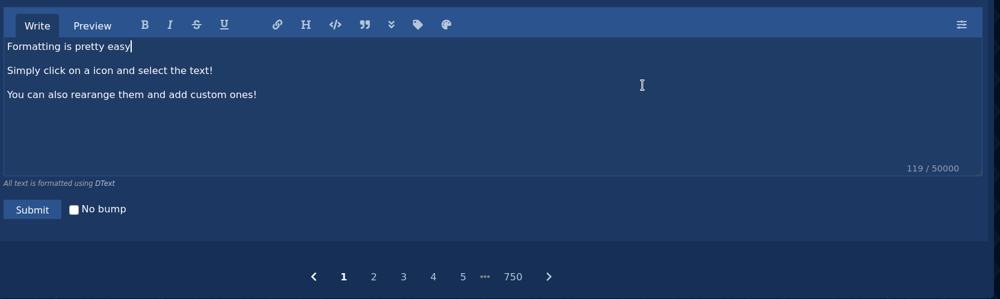
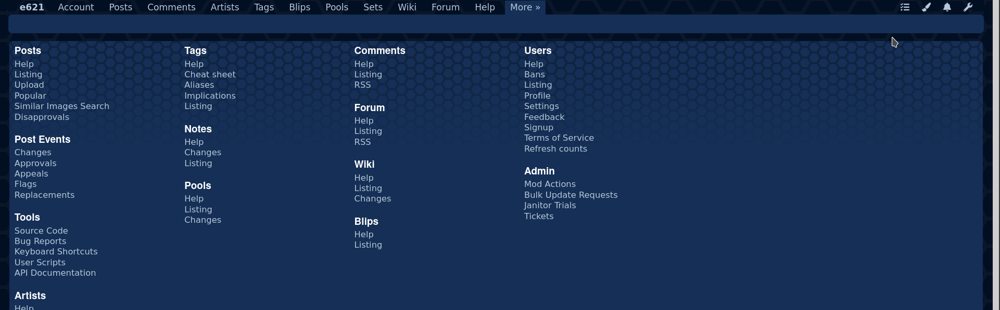
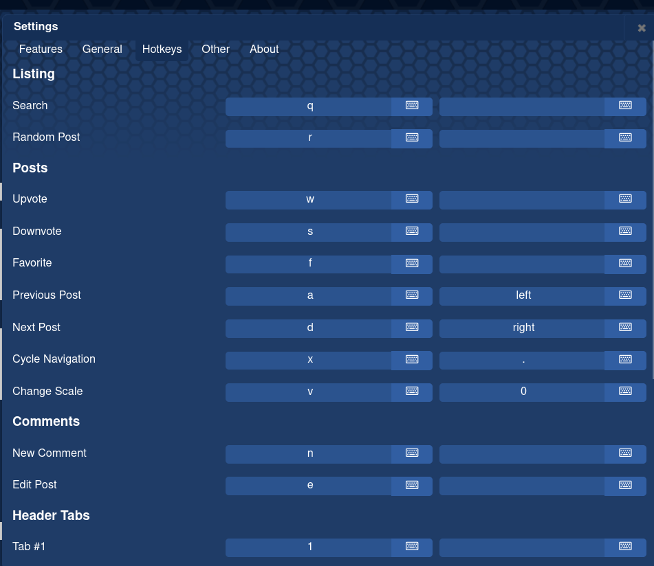
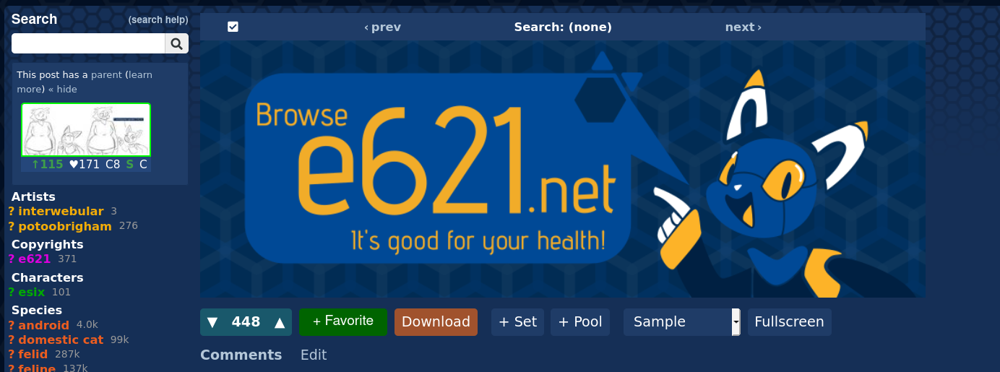
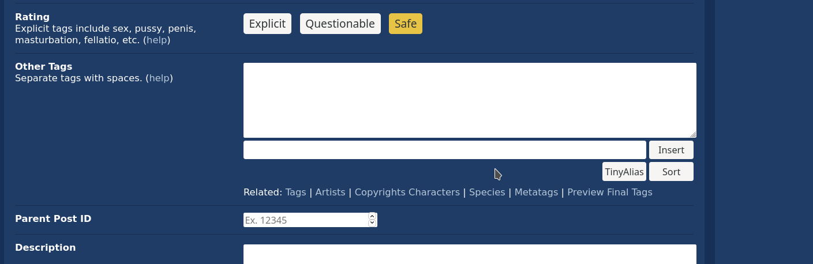

RE:621
================

## e621, Reimagined

RE621 is a comprehensive project created to improve the basic user experience while browsing e621.net. It consists of several different modules that enhance the entire site, top to bottom - literally.

## Installation

The project is delivered via a userscript. This means that you need a script manager, such as [Tampermonkey](https://www.tampermonkey.net/).

With a script manager installed, click on [this link](https://github.com/re621/re621/releases/latest/download/script.user.js) and follow the instructions on the new page.

## Features

The Userscript is divided into many modules, all of which add a variaty of functions.

### FormattingHelper

Adds a few common shortcuts to the dtext comment writer.

### HeaderCustomizer

Add, remove and customize the entries in the header

### KeyboardShortcuts

Reconfigure the newly added sgortcuts to whatever you want!

### PostViewer

We moved some stuff around to make an overall better experience

### InfiniteScroll

Who wants to click on the next page every time anyways, right?

### InstantSearch

Adding onto InfiniteScroll you can now add tags to your search without having to reload the page

### TinyAlias

It can be pretty tedious to type the same tags again and again. This tries to fix that

### Subscriptions for Forum/Pool/Tags

Be notified for new comments on forums, new entries in pools and new posts for tags

### Miscellaneous
* Added back the Theme Customizer
* Actually download the image when you click on the button
* Added a 4th scaling option for posts: Vertical
* Modify the title for the tab when you are viewing a post to your likeing
* Quickly add tags to your blacklist

## Contributing

Contributions are always welcome. For bug reports, suggestions, and feature requests, head on over to the [issue tracker](https://github.com/re621/re621/issues).
